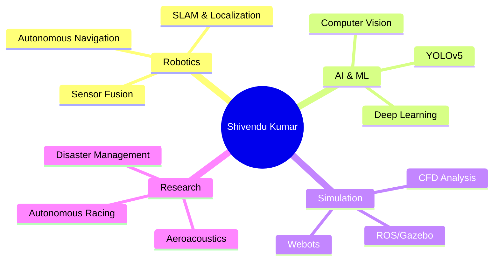

# Hi there, I'm Shivendu Kumar 👋

<div align="center">
  
  

</div>

<p align="center">
  <a href="mailto:kumarshivendu47@gmail.com"></a>
  <a href="https://www.linkedin.com/in/shivendu-kumar-5971112b9"></a>
  <a href="https://github.com/ShivenduKmr"></a>
</p>

---

## 🚀 About Me

```python
class ShivenduKumar:
    def __init__(self):
        self.username = "ShivenduKmr"
        self.education = "B.Tech Mechanical Engineering @ NIT Patna"
        self.cgpa = 8.1
        self.graduation_year = 2027
        self.current_role = "Research Intern @ IIT Jodhpur (SAIDE)"
        self.interests = ["Robotics", "Autonomous Systems", "AI/ML", "CFD"]
        
    def current_focus(self):
        return [
            "Autonomous drone systems for disaster management",
            "ROS-based robotics applications",
            "Deep learning for perception tasks",
            "Aeroacoustic simulations"
        ]
    
    def say_hi(self):
        print("Thanks for dropping by! Let's build something amazing together!")

me = ShivenduKumar()
me.say_hi()
```

---

## 🔬 Featured Research & Projects

### 🚁 AI-Powered Autonomous Search & Rescue Drone
**Research Intern @ IIT Jodhpur | May 2025 - July 2025**


- 🎯 Engineered complete autonomous drone system in **Webots** for urban disaster scenarios
- 🤖 Implemented dual-modality victim detection: **YOLOv5** for surface + **GPR simulation** for subsurface
- 📊 Achieved **84.7% confidence** in detecting buried targets using custom GPR signal processing
- 🗺️ Built A* path planner with dynamic obstacle avoidance + cascaded PID controller
- 🔧 **Tech Stack**: Python, Webots, PyTorch, ROS, NumPy, SciPy

**Status**: 📝 Findings being prepared for conference submission

<br clear="right"/>

---

### 🏎️ F1/10th Autonomous Racing Software Stack
**July 2025 - September 2025**

- ⚡ Developed complete **ROS-based** software stack for high-speed autonomous racing
- 🎯 Implemented **Pure Pursuit** algorithm for precise path tracking
- 🚧 Built reactive **Gap Finding** controller using 2D LiDAR for real-time obstacle avoidance
- 📍 Engineered SLAM pipeline with **particle filter AMCL** for robust localization
- 🔧 **Tech Stack**: ROS, Python, C++, Gazebo, SLAM, Linux

---

### 🔊 Aeroacoustic Analysis of Bio-Inspired Serrated Propeller
**August 2025**

- 🦉 Conducted full CFD analysis of bio-inspired (owl-like) propeller design
- 📉 Achieved **2.8 dB reduction** in Overall Sound Pressure Level (OASPL)
- 🌊 Used Scale-Adaptive Simulation (SAS) + Ffowcs Williams-Hawkings acoustic analogy
- 🔧 **Tech Stack**: ANSYS Fluent, SpaceClaim, ANSYS Meshing, CFD Post

---

## 💻 Tech Stack & Skills

<div align="center">

### Languages & Frameworks


### Robotics & AI


### Simulation & Design Tools


</div>

---

## 📊 GitHub Stats

<div align="center">
  
  
</div>

<div align="center">
  
</div>

---

## 🏆 Achievements & Highlights

🎓 **Research Intern** - IIT Jodhpur School of AI & Data Science (May-July 2025)  
🥇 **Top 5** - Material Spark 2025 Quiz Competition @ IIT Patna  
🎤 **Organizer** - Smart India Hackathon Presentation Round @ NIT Patna  
💼 **Sponsorship Lead** - ByteVerse Annual Hackathon @ NIT Patna  
📜 **Certifications**: Design for 3D Printing (Udemy), Computer Integrated Manufacturing (NPTEL)

---

## 👥 Leadership & Positions

<table>
  <tr>
    <td align="center">
      <b>Office Bearer</b><br>
      Hackslash Developers Club<br>
      <i>Aug 2025 - Present</i>
    </td>
    <td align="center">
      <b>Event & PR Lead</b><br>
      ISIE NITP SRA<br>
      <i>Oct 2024 - Dec 2025</i>
    </td>
    <td align="center">
      <b>Content Team</b><br>
      Hackslash Developers Club<br>
      <i>Aug 2024 - May 2025</i>
    </td>
  </tr>
</table>

---

## 📈 Contribution Graph

<div align="center">
  
</div>

---

## 🎯 Current Focus Areas



---

## 📫 Let's Connect!

<div align="center">

I'm always excited to collaborate on robotics, AI, and autonomous systems projects!

**💬 Open to**:
- Research collaborations
- Open source contributions
- Internship opportunities
- Technical discussions

**📧 Reach out**: kumarshivendu47@gmail.com

---


</div>

---

<div align="center">
  
</div>
