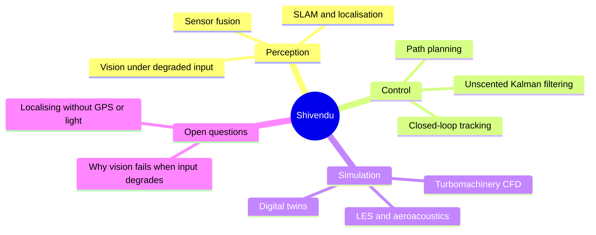

<div align="center">
  
</div>

<div align="center">

[](https://git.io/typing-svg)

<a href="mailto:kumarshivendu47@gmail.com"></a>
<a href="https://www.linkedin.com/in/shivendu-kumar-5971112b9"></a>
<a href="https://shivendukmr.github.io"></a>


</div>

---

## About

I build machines that have to work out where they are and what they are looking at — a racing car
with no driver, a drone mapping a mine where GPS cannot reach, a camera sorting waste on a moving
belt. Most of my useful work has been figuring out **why something failed when the obvious
explanation was wrong.**

```python
class ShivenduKumar:
    def __init__(self):
        self.education   = "B.Tech Mechanical Engineering @ NIT Patna"
        self.cgpa        = 8.06
        self.graduating  = 2027
        self.fellowship  = "Chanakya UG Fellow, TEXMiN @ IIT (ISM) Dhanbad"
        self.papers      = 2          # one as first author
        self.available   = "6-month internship from mid-December 2026"

    def what_i_actually_do(self):
        return {
            "perception":  ["sensor fusion", "SLAM", "vision transformers"],
            "control":     ["PID", "Pure Pursuit", "unscented Kalman filter"],
            "simulation":  ["ANSYS CFX", "LES-WALE", "FW-H acoustics"],
            "when_stuck":  "stop assuming, go look at the raw data",
        }
```

---

## Experience

| Where | Role | When |
|---|---|---|
| **Shoonya Recycling**, New Delhi | Product Analytics & Computer Vision Intern | May – Jul 2026 |
| **Vazirani Automotive**, Mumbai | System Design Intern | May – Jul 2026 |
| **IIT Jodhpur**, School of AI & Data Science | Robotics Research Intern | May – Jul 2025 |

<details>
<summary><b>What I actually did →</b></summary>

<br>

**Shoonya Recycling** — An automated sorting line was missing throughput and nobody could say why.
My first assumption was the model needed more training data. It did not. Comparing misclassifications
against what physically happened on the belt showed the failures clustered on **motion blur and
underexposure** — an input problem, not a model one. Fixed with CLAHE contrast enhancement and a
move from a CNN to a vision transformer, whose global attention holds up where local texture is
unreliable.

**Vazirani Automotive** — Designed an axial fan compressor doing two jobs at once: generating
downforce and feeding forced-air cooling to the battery pack. Ran the baseline CFD in ANSYS — a
blade passage meshed in TurboGrid to a 3 µm first cell, then the 11-blade, 12,000 rpm stage solved
in CFX with SST *k*–ω at 0.07 kg/s.

**IIT Jodhpur** — Fused camera, ground-penetrating radar and IMU streams from UAV trials into one
perception pipeline across three different sampling rates and failure modes. Built the evaluation
harnesses that made detection performance legible across terrain.

</details>

---

## Featured work

### Search-and-rescue UAV — dual-modality detection


Two ways of finding people: **YOLOv5** on the surface, simulated **GPR** below it.
**84.7% detection confidence across 50+ runs.** The part worth talking about is not the number —
it is knowing which conditions made each sensor lie.

A* global planner with dynamic obstacle avoidance and cascaded PID control, built in Webots.

`Python` `PyTorch` `Webots` `SciPy` `NumPy`

📄 **Published** — *Modeling and Simulation of UAV-Based Search and Rescue*, ICAMAS 2026

[**→ Repository**](https://github.com/ShivenduKmr/rescue_drone_2)

<br clear="right"/>

---

### F1/10th autonomous racing stack

Nobody assigned this one. A full autonomous racing stack on Linux:

- **2D LiDAR SLAM** with particle-filter (AMCL) localisation
- Closed-loop **Pure Pursuit** path tracking
- Reactive **gap-finding** controller that picks a line through obstacles at speed

`ROS` `C++` `Python` `Gazebo` `Linux`

[**→ Repository**](https://github.com/ShivenduKmr/F1-tenth-autonomous-racing)

---

### Mapping a mine with no GPS and no light

Underground tunnels defeat visual localisation: no ambient light, and brick walls that repeat every
few metres so every frame looks like the last.

An **unscented Kalman filter** fusing 100 Hz IMU with sparse visual features and LiDAR cut
positional drift **82.4%, down to 0.07 m** over a 60 m gallery. Artificial potential field for
obstacle avoidance, and a 3D digital twin built from the LiDAR returns.

`ROS2` `Gazebo Fortress` `UKF` `V-SLAM`

📄 **First author** — *AI-Enabled Autonomous Mapping in Underground Environments*
· Funded by the TEXMiN Chanakya Undergraduate Fellowship

---

### Why half a good idea made things worse

Owl-inspired serrations on a UAV propeller, three geometries, transient large-eddy simulation with
the Ffowcs Williams–Hawkings acoustic analogy.

- Full-span serration cut noise by **3.87 dB** (OASPL)
- Serrating only **half** the blade made it **1.87 dB worse**
- The cause was not the serration but the **junction** between treated and untreated sections

The transition was wrong, not either half. That result is the reason the study was worth doing.

`ANSYS Fluent` `LES-WALE` `FW-H` `Fusion 360`

[**→ Repository**](https://github.com/ShivenduKmr/Fluent-analysis-of-serrated-airfoil)

---

### Industrial autonomous mobile robot

A 500 × 500 × 500 mm chassis carrying **20 kg at 1 m/s**, drivetrain sized from first principles to
a 2.0 safety factor (127.3 RPM, 27.5 N). 6 mm aluminium 6061 base plate, an ABS mezzanine isolating
the compute from motor vibration, and a **TS35 DIN rail** so standard components mount without
custom brackets.

`Fusion 360` `Kinematics` `Structural analysis`

---

### Health Atlas — EY Techathon 6.0


**Semifinalist from 115,000+ registrations.** A healthcare analytics product taken from research to
working software in a competition sprint — market and competitor research, then requirements and
wireframes, then a multi-agent pipeline with an NLP layer turning unstructured reports into ranked
KPI dashboards a non-technical reader can act on.

`Multi-agent AI` `NLP` `Streamlit` `Figma` `Python`

[**→ Repository**](https://github.com/Rupali2507/Health_Atlas)

<br clear="right"/>

---

## Stack

<div align="center">

**Languages**


**Robotics & perception**


**Vision & ML**


**Simulation & CAD**


</div>

---

## Stats

<div align="center">


</div>

---

## Honours

| | |
|---|---|
| 🎓 | **Chanakya Undergraduate Fellow** — TEXMiN Foundation, IIT (ISM) Dhanbad. One of a small number of undergraduates nationally funded to define and run an independent research project. |
| 🥇 | **1st place & Best Speech** — UNESCO-WWDR Model UN, for a data-backed technical strategy on antimicrobial resistance argued before an international panel. |
| 🛰️ | **Team Sub-Lead** — ISRO URSC Challenge 2026. Led technical contributions and hardware integration to the national elimination round. |
| 💡 | **Semifinalist** — EY Techathon 6.0, from 115,000+ registrations. |
| 🌊 | **Finalist** — EU-India Ideathon 2025, marine plastic pollution, among 150+ international participants. |
| 📊 | **Ranked 25 nationally** — Naukri Campus EROH, from 110,000+ applicants. Top 5 at Material Spark 2025, IIT Patna. |

<details>
<summary><b>Leadership & positions →</b></summary>

<br>

| Role | Organisation | When |
|---|---|---|
| Office Bearer | Hackslash Developers Club, NIT Patna | Aug 2025 – present |
| Event & PR Lead | ISIE NITP SRA | Oct 2024 – Dec 2025 |
| Content Team | Hackslash Developers Club | Aug 2024 – May 2025 |
| Sponsorship Lead | ByteVerse Annual Hackathon, NIT Patna | 2025 |
| Organiser | Smart India Hackathon presentation round, NIT Patna | 2025 |

**Certifications** — Design for 3D Printing (Udemy) · Computer Integrated Manufacturing (NPTEL)

</details>

---

## What I am working on


```mermaid
mindmap
  root((Shivendu))
    Perception
      Sensor fusion
      SLAM and localisation
      Vision under degraded input
    Control
      Unscented Kalman filtering
      Closed-loop tracking
      Path planning
    Simulation
      LES and aeroacoustics
      Turbomachinery CFD
      Digital twins
    Open questions
      Why vision fails when input degrades
      Localising without GPS or light
```

---

<div align="center">

### Open to a six-month internship from mid-December 2026

Robotics · computer vision · simulation · product

**kumarshivendu47@gmail.com**


</div>
